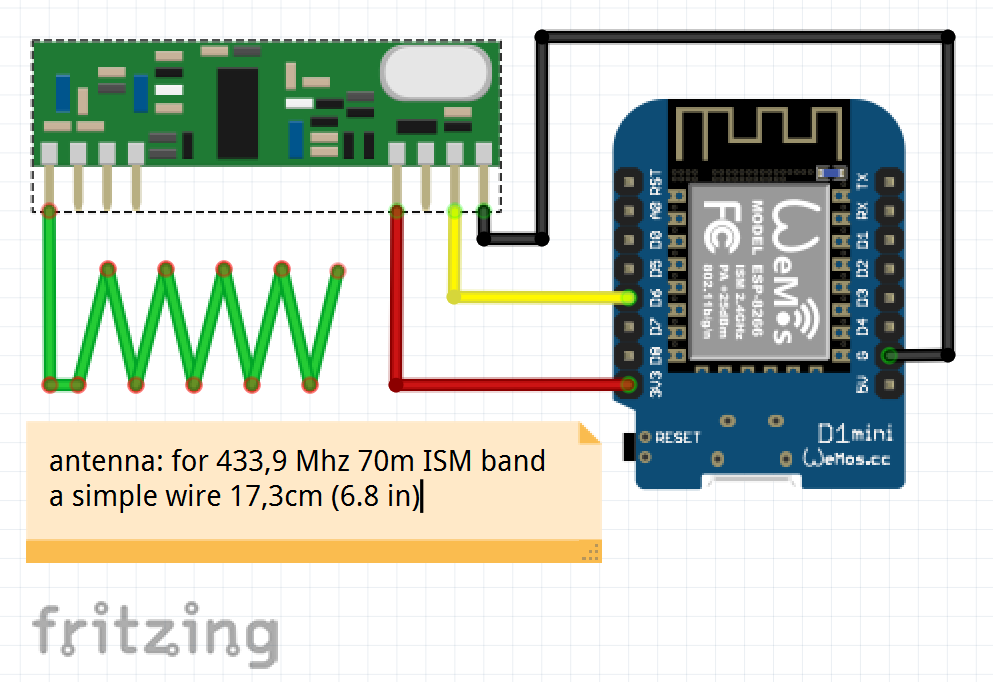

# ESPHome 433MHz Sensor hub

This project is for decoding 433MHz AM transmissions of a GT-WT-02 and AFT 77 A1 weather station transmitters.
There are a lot of identical transmitters sending a 37bit protocol with checksum for temperature and humidity.

Later on I got a bunch of DIGOO DG-TH8898 weatherstations including temperature/humidity and raingauge aensors.
Unfortunately their 36bit protocol does not include a checksum, what makes it nore complex to get reliable values.
This repository is confugured to use these Digoo sensors right now. But the sensor type can set within the
configuration.yaml file. Allowed values are:

- "DRY-TEST" emulates a sensor transmission with random values every 10s
- "GT-WT-02" for the General Tech sensors
- "DG-TH8898" for the DIGOO sensors,

The initial decoder source was designed for the Arduino IDE and an ESP8266 device and got migrated to a
ESPhome Sensor Hub component meanwhile. Before I implemented MQTT Sensors for HomeAssistant. But I like ESPHome
because it is easier to use and does communicate with HomeAssistant faster.

As additional hardware you will need a 433MHz AM receiver for generating pin interrupts.
It is strongly recommended to use a Superheterodyne 433MHz RF module like the 3400RF or RXB6.

To be honnest, with the RXB6 I've got the most stable resuls and range of reception. I really tried a lot
of these 433MHz AM receivers in the past but **the RXB6 is the only one I do recommend to use!**
With VCC at 3.3V it provides a low noise level and detects avtive modulation phases very well.

These receivers operate at 3.3V without any issues. NOTE: the data output of these receivers is level based,
but has a high impedance. Therefore it may not work at GPIO pins with integrated pull up/pull down resistors!

The reception routine has been improved over years and operates more reliable than the original weather stations
belonging to them. The received codes are stored in a ringbuffer. There have to be recorded at least 2 equal
codes in a transmission block. It is possible to decode even interferd signals of different sensors.

The challenge of this project has been the detection and digital noise canceling of the weak AM signal of the
transmitter out of a very noisy 433MHz band environment. Therefore pulse detection relies on active periods
of the AM signal only to achieve the best possible reception range.

The Rx data pulses are captured and analyzed interrupt driven. The decoding is done in the ESPHome loop()
and published to the according sensors. The rain sensor has a history functionality to calculate the rate
and accumulated sum of the last 48h.

if you want to get outside weather values like temperature, humidity and precipation, decoding these
low power rf sensors may be the smartest way to go. The sensors are chaep and accurate, made for outdoor
use and the batteriess last for at leat 18 month. Don't get me wrong, I'am a fan of DIY sensors too, but
many existing products do the job better.

Wiring diagram:

