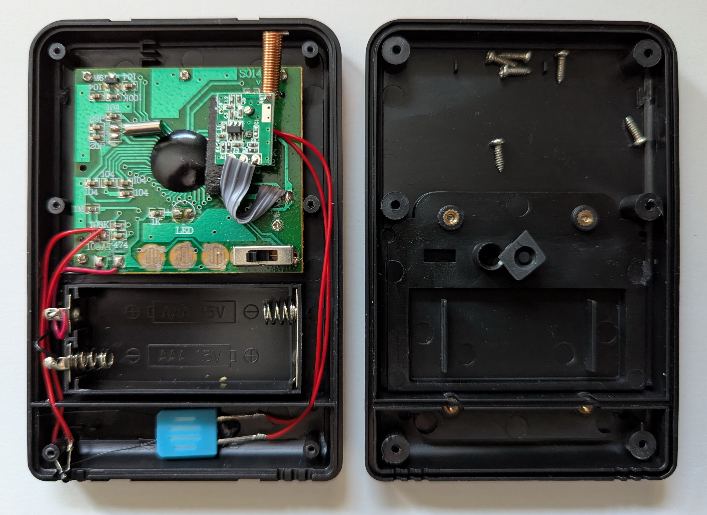

# The DIGOO DG-TH8898 weather sation

This complete weatherstation DIGOO DG-TH8898 has been on sales in May 2020 at [amazon.de](https://www.amazon.de/dp/B07DPFJ4RC) for 6,99€ only.
For this price you won't get a sensor replacement for any other weather station. Therefore I orderd a bunch of them
after knowing how to decode the sensors. Within 5 Years only one of the T/H sensors got partly defect, because it
is changing it's transmitter ID randomly. The rain gauge of this set is a very common design but not reliable at all.
It is very sensitive to weak AA batteries and spiders nest inside. I swapped the gauge electronis to a Pollin PFR-130
rain gauge and added a 3d printed funnel for getting a pulse at every 0.25mm of rain. The PFR-130 takes two AA batteris
which last for about 2 years. This device much more robust and has been working reliable for 4 years now.

Untortunately the T/H transitters have no model number at all. The circuit board is marked with "S014BH ver.0"

Modified rain gauge:

